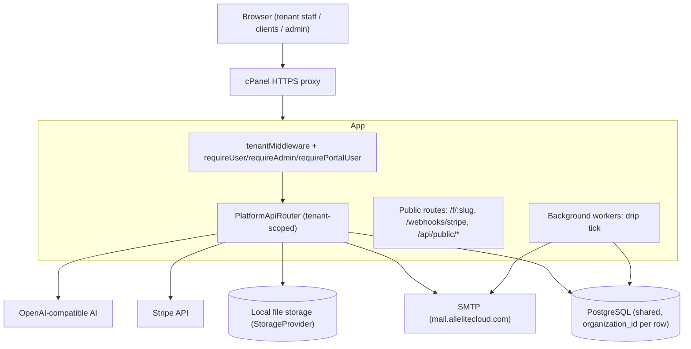

# 01 — Architecture

The master technical architecture of All Elite Cloud.

## Overview

All Elite Cloud is a **multi-tenant, white-label business operating system**.
It runs as its own Node process (separate from the legacy single-tenant Faith
Harbor OS) against a shared PostgreSQL database, with per-row tenant isolation.

## Frontend architecture

The platform UI is **server-rendered, self-contained HTML + vanilla JS**,
generated by `src/platform/web/pages.ts` (dashboard, login, signup, reset,
public form pages, admin console). No build step, no SPA framework. It talks to
the JSON API via `fetch`. (The `frontend/` React app in the repo is the legacy
Faith Harbor OS, not this platform.) A future decision may modularize this or
introduce a component framework; see `07_DECISIONS.md`.

## Backend architecture

Express 4 + TypeScript, compiled to `dist/`. Composition root
`createPlatformApp.ts` wires middleware, the three auth surfaces, public
routes, branding, and the tenant API. `platformServer.ts` constructs every
service from environment config and starts the HTTP server + workers.

Every domain module follows the same **port pattern**: entity → repository
(extends `TenantScopedRepository`) → service (business rules + validation) →
schema table → API block in `PlatformApiRouter` → dashboard panel → tests.

## Database architecture

Single PostgreSQL database, shared across tenants. Every tenant-owned table has
`organization_id` with a FK to `organizations(id) ON DELETE CASCADE`. Schema is
created idempotently in `PostgresDatabase.initialize()` (`CREATE TABLE IF NOT
EXISTS`). Timestamps are stored as UTC ISO-8601 text. See `02_DATABASE.md`.

## Multi-tenant design

- `TenantContext` (`AsyncLocalStorage`) carries the current `organizationId`.
- `requireTenant()` throws if there is no context — **fail closed**.
- `TenantScopedRepository.tenantId()` reads it and every query filters
  `organization_id = <it>` explicitly (visible in each query, not hidden).
- `runWithTenant({organizationId}, fn)` establishes scope (middleware for
  requests; workers/public flows set it explicitly per tenant).

## Authentication architecture

Three independent httpOnly-cookie session surfaces, all server-side and
revocable, passwords hashed with scrypt:

- `aec_session` — tenant team members
- `aec_admin` — platform administrators (cross-tenant)
- `aec_portal` — a tenant's client-portal users

See `04_SECURITY.md`.

## Authorization model

Role guards enforced in the API layer via `requireRole("owner"|"admin"|...)`
and, for the portal, per-client scoping. Roles: owner, admin, member. Platform
admins use the separate admin surface, never a tenant session.

## Session management

Sessions are random 256-bit tokens stored server-side with expiry; validated on
each request; deletable (logout/compromise). Cookies are httpOnly, SameSite=Lax,
Secure in staging/prod.

## AI architecture

Injectable, tenant-neutral generator (OpenAI-compatible base URL) for the
website builder; per-tenant BYO keys; usage metering in micro-dollars with
monthly plan allowance caps. Knowledge Base retrieval is behind a
`RetrievalProvider` abstraction (keyword now, pgvector-ready). See `09_AI.md`.

## Workflow architecture

Not yet built (Phase 3). Will reuse the activity event spine and the
tick-worker pattern (see below).

## Event architecture

`ActivityService.record()` writes a tenant-scoped `activity_events` row and
fans out to subscribed handlers (best-effort, never throwing into the caller).
Consumers today: the Notification dispatcher and the Customer Journey Timeline.
Future consumers: Workflows, Webhooks.

## Background workers

Started in `platformServer.ts` via `setInterval` (`unref`'d). Today: the **drip
tick** (every 60s) advances due autoresponder enrollments across all tenants —
a global scan discovers due rows, then each is processed inside its own tenant
scope.

## Storage architecture

`StorageProvider` interface abstracts file bytes. `LocalStorageProvider` writes
under a single root and refuses path escapes; keys are random tenant-prefixed
UUIDs. Swappable for S3-compatible storage later. Metadata lives in the tenant
`files` table.

## Security model

Fail-closed tenant isolation, parameterized SQL only, scrypt passwords,
httpOnly revocable sessions, server-side authorization, MIME-allowlisted +
quota-limited uploads, Host-header-independent reset links, secrets only in
`~/aecloud/.env`. Outstanding: login rate-limiting, RLS backstop, audit
logging. See `04_SECURITY.md`.

## White-label architecture

Per-tenant branding (name, logo, colors) applied to tenant-facing surfaces;
custom domains verified via DNS TXT and served live. Expanding in Phase 5.

## Marketplace architecture

Not built (Phase 4). Planned: first-party module registry with feature flags;
no arbitrary third-party code execution until a secure sandbox exists.

## API architecture

JSON over HTTP. Tenant API under `/api/platform/*` behind `requireUser` +
tenant middleware. Public surfaces: `/api/public/forms/:slug/submit`,
`/f/:slug`, `/webhooks/stripe`. Consistent `{ error: { code, message } }`
shape. See `03_API.md`. A versioned external API (`/api/v1`) is Phase 6.

## Integration architecture

Stripe (subscriptions + webhooks, raw-body verified), SMTP (raw net/tls, no
SDK), OpenAI-compatible AI. Outbound webhooks + public API are Phase 6.

## Deployment architecture

Compiled `dist` shipped over SSH to cPanel; `keepalive.sh` cron watchdog keeps
the process up; secrets in `~/aecloud/.env`. See `10_DEPLOYMENT.md`.
