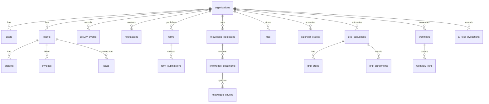

# 02 — Database

PostgreSQL, shared across tenants. Schema is created idempotently in
`src/persistence/PostgresDatabase.ts` (`CREATE TABLE IF NOT EXISTS`) — this
file is the source of truth; keep this doc synchronized with it.

## Conventions

- Every tenant-owned table has `organization_id TEXT NOT NULL REFERENCES
  organizations(id) ON DELETE CASCADE`.
- Primary keys are `TEXT` UUIDs unless noted.
- Timestamps are UTC **ISO-8601 strings** (`TEXT`), not `timestamptz` (a known
  trade-off; see `07_DECISIONS.md`).
- Structured columns use `JSONB`.
- Every query filters `organization_id` explicitly (see `04_SECURITY.md`).

## Migration history

No incremental migration files yet — schema is additive via
`initialize()`. Down-migrations/rollback are outstanding technical debt. Each
new table is introduced in the milestone that adds its module (see
`06_CHANGELOG.md`).

## Core / identity

| Table | Key columns | Tenant | Notes |
|---|---|---|---|
| organizations | id, name, slug (unique) | (root) | The tenant |
| users | id, organization_id, email, password_hash, name, role, status | ✓ | role: owner/admin/member; unique-ish per org+email |
| platform_sessions | token (PK), user_id, organization_id, expires_at | ✓* | looked up by token globally |
| admins | id, email, password_hash | (platform) | cross-tenant admins |
| admin_sessions | token (PK), admin_id, expires_at | (platform) | |
| password_reset_tokens | token_hash (PK), organization_id, user_id, expires_at, used_at | ✓ | only SHA-256 hash stored; index (org,user) |
| portal_users | id, organization_id, client_id, email, password_hash | ✓ | UNIQUE(org,email) |
| portal_sessions | token (PK), client_user_id, organization_id, client_id, expires_at | ✓ | |

## Business modules

| Table | Notable columns | Notes |
|---|---|---|
| clients | id, org, name, email, company, status | |
| projects | id, org, client_id, name, description, status | |
| invoices | id, org, number, client_id, line items, amount, status | numbered per org |
| support_tickets | id, org, client_id, subject, description, priority, status, assignee | |
| leads | id, org, client_id, name, company, email, phone, source, service_interest, estimated_value, status, owner, notes | |
| proposals | id, org, client_id, title, summary, body, amount, status | |
| campaigns | id, org, name, channel, budget, status | |
| reviews | id, org, author, rating, source, comment | |
| brands | id, org, name, … | multi-brand |
| products | id, org, client_id, name, language, status, repo_url, … | |
| books | id, org, title, author, … | publishing |
| programs | id, org, name, description, … | ministry |
| hosting_accounts | id, org, client_id, domain, plan, status | tracking (no WHM yet) |
| organization_domains | id, org, domain, verified, verification_token | DNS TXT verify |
| organization_subscriptions | org, plan, stripe ids, status | Stripe |
| websites | id, org, client_id, name, brief, html, status, domain | AI builder |
| organization_ai_settings | org, provider, api key, … | BYO AI |
| ai_usage_events | id, org, cost micro-$, … | metered; indexed |
| emails | id, org, to_address, subject, body, from_address, status, provider, error, created_at | outbox |

## Phase 1–2 platform tables

| Table | Columns | Indexes |
|---|---|---|
| activity_events | id, org, type, actor_type, actor_id, actor_name, subject_type, subject_id, title, summary, metadata JSONB, created_at | (org,subject_type,subject_id,created_at desc); (org,created_at desc) |
| notifications | id, org, user_id, type, title, body, link, read_at, created_at | (org,user_id,read_at,created_at desc) |
| drip_sequences | id, org, name, trigger, status, timestamps | |
| drip_steps | id, org, sequence_id→drip_sequences, position, delay_hours (double), subject, body | (org,sequence_id,position) |
| drip_enrollments | id, org, sequence_id, email, name, step_index, status, next_run_at, timestamps | (status,next_run_at) for the worker |
| files | id, org, name, stored_key, mime_type, size (bigint), tags JSONB, subject_type, subject_id, uploaded_by, deleted_at, created_at | (org,deleted_at,created_at desc); (org,subject) |
| forms | id, org, name, slug (UNIQUE), fields JSONB, confirmation_message, notify_email, create_lead, status, timestamps | (org,created_at) |
| form_submissions | id, org, form_id→forms, data JSONB, status, created_at | (org,form_id,created_at desc) |
| calendar_events | id, org, title, description, location, start_at, end_at, all_day, subject_type, subject_id, created_by, timestamps | (org,start_at) |
| knowledge_collections | id, org, name, description, timestamps | |
| knowledge_documents | id, org, collection_id→knowledge_collections, name, mime_type, status, chunk_count, error, created_at | |
| knowledge_chunks | id, org, collection_id, document_id, position, content, created_at | (org,collection_id) |

## ERD (selected)

### AI tool invocations (P3-M2)

- **`ai_tool_invocations`** — one row per AI tool call. Columns: `id`,
  `organization_id`, `tool_name`, `mode` (`read` | `write`), `args` (JSONB),
  `status` (`executed` | `pending` | `rejected` | `failed`), `summary`,
  `requested_by`, `created_at`, `updated_at`. Read tools land `executed`;
  write tools land `pending` and move to `executed`/`failed` on confirm, or
  `rejected` if declined. Indexed on `(organization_id, status, created_at)`.

### Workflow tables (P3-M1)

- **`workflows`** — one automation per row. Columns: `id`, `organization_id`,
  `name`, `trigger` (an activity-event type, indexed with `organization_id` +
  `status` for the trigger lookup), `status` (`active` | `paused`), `steps`
  (JSONB array of `{id,type,delayHours,config}`), `created_at`, `updated_at`.
- **`workflow_runs`** — one in-flight/finished run per triggered subject.
  Columns: `id`, `organization_id`, `workflow_id`, `trigger_type`,
  `subject_type`, `subject_id`, `context_email`, `context_name`, `step_index`,
  `status` (`running` | `completed` | `failed`), `next_run_at` (indexed for the
  cross-tenant due scan), `log` (JSONB append-only step log), `created_at`,
  `updated_at`.
